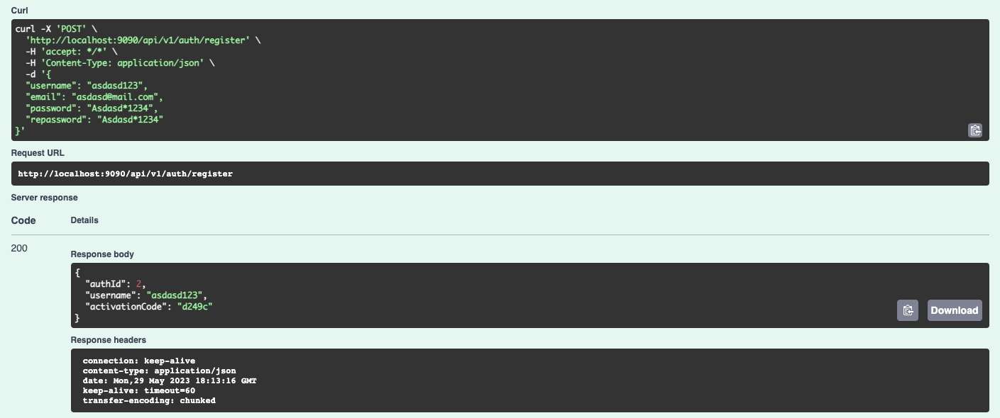
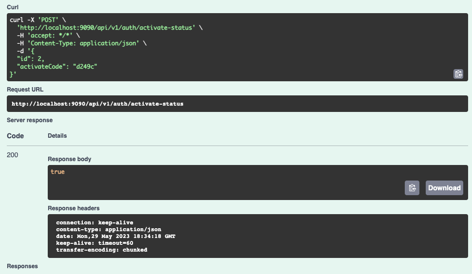
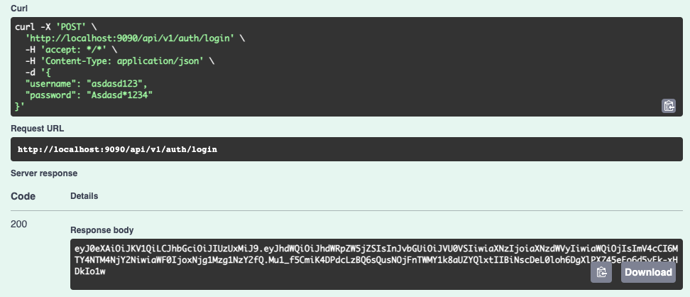
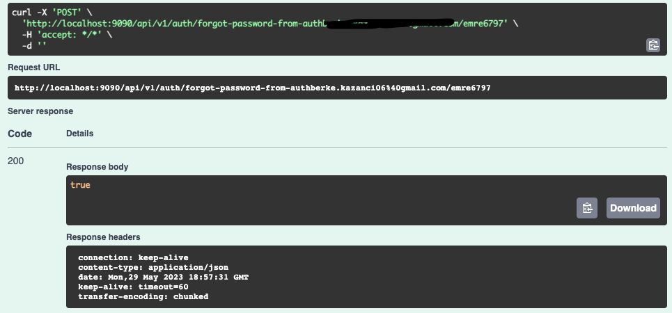
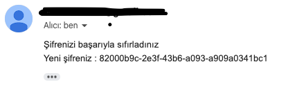
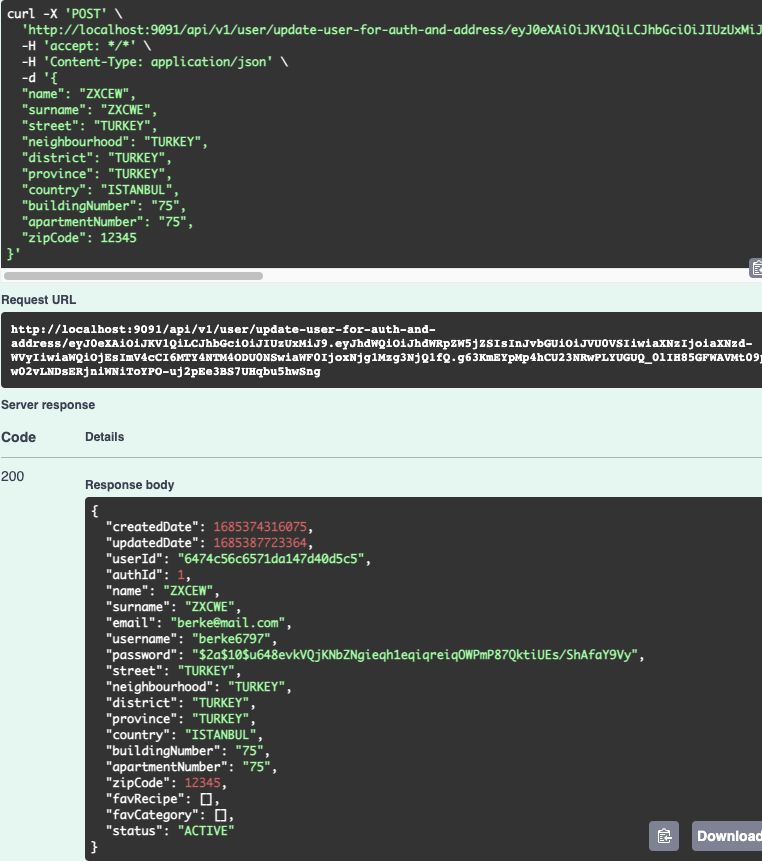
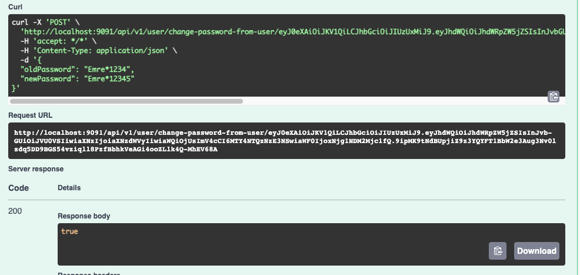

# RECIPE APP
The Recipe Book project is a Spring Boot application where administrators can add recipes, and users can add them to their favorites, leave comments, and rate them. Users can register and log in to the system. They can rate recipes, make comments, and even add recipes to their favorites.

## TECHNOLOGIES
This project , written in Java, utilizes technologies such as _OpenFeing_, _RabbitMQ_, _Redis_,and _Zipkin_  
The project uses _MongoDB_ and _PostgreSQL_ as the database technologies

---
There are 5 services in the project. These services are: auth service,comment service,mail service,recipe service, user service

AUTH SERVICE

The Auth Service is primarily a service designed for user-related operations. In this service, users can register, activate their accounts, log in, and reset their passwords via email in case of forgetting.  

#### api/v1/register  
This method is used to perform user registration, and after that, the returned activation code should be used to activate the account before the user can log in. An activation code is sent to the registered user's email for account activation before logging in.

#### api/v1/activate-status  
This method is responsible for activating the account only.

#### api/v1/login  
This method is used to perform the login process for activated accounts. After successful login, the returned token is used to perform the necessary operations.

#### api/v1/forgot-password-from-auth  
This method is used to reset the password for a user account using their username and email. As a result, a randomly generated password is set, and it is sent to the user's email account for password reset.

USER SERVICE  
The User Service is responsible for allowing users to view, modify, and delete their user information.  

#### api/v1/user/update-user-for-auth-and-address  
This method is used to update the address information of a registered and activated user.

#### api/v1/user/change-password-from-user  
This method allows the user to change their password.

#### api/v1/user/change-password-from-user  
This method allows the user to change their password.
